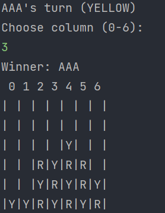

# Connect 4 Game

#### 🧪

#### 📝 Description
Connect 4 game is a two-player connection board game, in which the players turns dropping colored tokens (Y-Yellow, R-Red) into a seven-column, six-row vertically suspended grid. 
The pieces fall straight down, occupying the lowest available space within the column. The objective of the game is to be the first to form a horizontal, vertical, 
or diagonal line of four of one's own tokens.

#### 🛠️ Built with
 * Java
